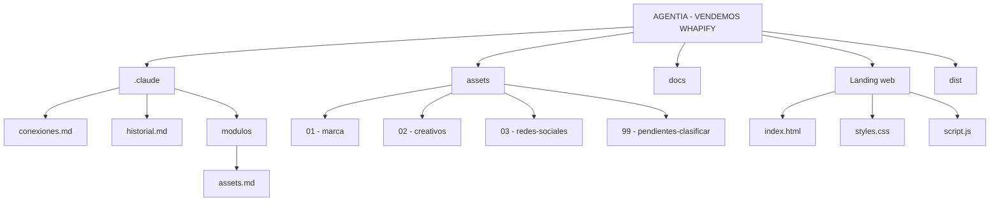

# Conexiones del proyecto

Este diagrama muestra como esta organizado el proyecto AgentIA en este momento.

```mermaid
graph TD
    Cliente["AGENTIA - VENDEMOS WHAPIFY"] --> Control[".claude"]
    Cliente --> Assets["assets"]
    Cliente --> Docs["docs"]
    Cliente --> Web["Landing web"]
    Cliente --> Dist["dist"]

    Control --> Conexiones["conexiones.md"]
    Control --> Historial["historial.md"]
    Control --> Modulos["modulos"]
    Modulos --> AssetsDoc["assets.md"]

    Assets --> Marca["01 - marca"]
    Assets --> Creativos["02 - creativos"]
    Assets --> Redes["03 - redes-sociales"]
    Assets --> Pendientes["99 - pendientes-clasificar"]

    Web --> Index["index.html"]
    Web --> Styles["styles.css"]
    Web --> Scripts["script.js"]
```
