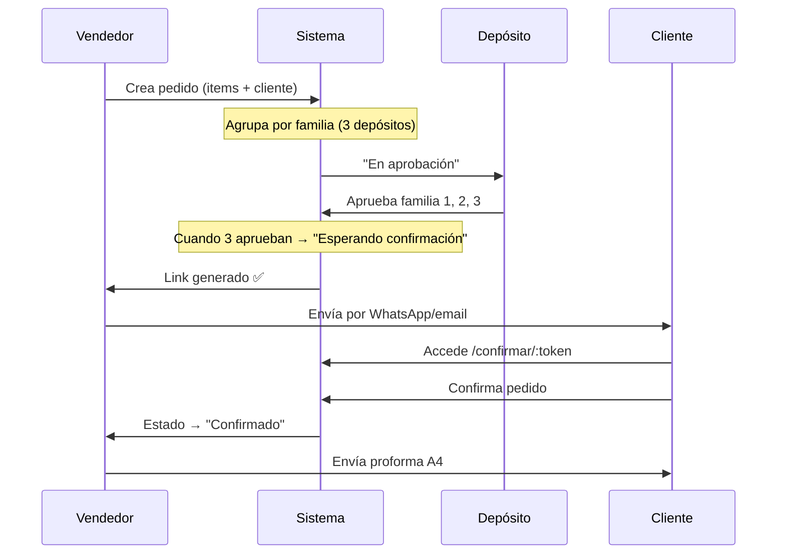

# Córdoba Bulones - Cotizador App

**Sitio en vivo:** https://bulonera.nazarenolozano.de

---

## 📋 Descripción General

Aplicación de cotización y gestión de pedidos para **Bulonera Córdoba**, una ferretería industrial argentina. Permite crear, aprobar y confirmar pedidos separados por depósitos (bulonería, tolsen, mechas), con interpretación automática de fotos de pedidos via OpenAI, validación de roles y generación de proformas.

---

## 🏗️ Arquitectura

```
Frontend (React + Vite)     Backend (PHP)               Database (MySQL)
├── React Router            ├── Auth (JWT)              ├── clientes
├── Tailwind CSS            ├── CRUD rutas              ├── productos
├── Context API             ├── Aprobaciones workflow   ├── personal
└── localStorage            ├── OpenAI integration      ├── aprobaciones
                            └── Apache + .htaccess      ├── config
                                                        └── tipos_descuento
```

### Dominio
- **Hosting:** Hostinger Premium (Apache + PHP)
- **Base de datos:** MySQL compartida en Hostinger
- **Ruta base:** `/` (dominio raíz `bulonera.nazarenolozano.de`)

---

## 🛠️ Stack Tecnológico

| Componente | Tecnología |
|:-----------|:-----------|
| **Frontend** | React 18, Vite, React Router 6, Tailwind CSS, Context API |
| **Backend** | PHP 8.0+ (puro, sin frameworks) |
| **Autenticación** | JWT (30 días) |
| **Base de datos** | MySQL 5.7+ |
| **Búsqueda de productos** | Fuse.js (fuzzy), PDO queries |
| **IA** | OpenAI GPT-4o-mini (interpretación de fotos) |
| **Herramientas** | ExcelJS (exportación), cURL (APIs externas) |

---

## 👥 Usuarios y Roles

### 1. **Administrador** (acceso total)
- Ver/crear/editar/eliminar clientes, productos, usuarios
- Aprobar pedidos por depósito
- Ver todas las secciones
- Configurar integraciones (OpenAI, Tango)

### 2. **Vendedor** (flujo comercial)
- Crear nuevos pedidos
- Ver aprobaciones (solo lectura)
- Ver cotizaciones confirmadas
- Enviar links de confirmación a clientes
- Gestionar clientes y productos

### 3. **Depósito** (aprobaciones únicamente)
- Ver pedidos en su depósito
- Aprobar stock por familia
- NO puede enviar al cliente
- NO ve otras secciones

---

## ✨ Funcionalidades Principales

### 1. **Nuevo Pedido**
- Búsqueda difusa de productos por código/descripción
- Carga manual de productos o **interpretación automática de fotos** (OpenAI)
- Agrupación automática por familia/depósito
- Cálculo de descuentos por tipo de cliente
- Vista previa antes de enviar a aprobación

### 2. **Aprobaciones (Workflow de 3 Depósitos)**
1. Pedido llega a "En aprobación"
2. Se separa en 3 sub-pedidos (bulonería, tolsen, mechas)
3. Cada depósito aprueba su familia independientemente
4. Cuando todos aprueban → estado "Esperando confirmación"
5. Se genera link público para cliente

### 3. **Confirmación del Cliente**
- Link único (token) sin autenticación
- Página A4-ready (proforma)
- Botón "Confirmar" → estado "Confirmado"
- Accesible vía: `/confirmar/:token` (ruta pública)

### 4. **Cotizaciones**
- Ver pedidos confirmados
- Descargar proforma en A4
- Historial completo por cliente

### 5. **Gestión**
- **Clientes:** CRUD, tipos de descuento (A/B/C/D), historial de pedidos
- **Productos:** 4724 artículos en 3 familias, búsqueda por código/medida
- **Personal:** Crear usuarios, asignar roles/permisos por sección
- **Integraciones:** API keys de OpenAI (guardadas en BD, no en código)

---

## 🔐 Seguridad

| Aspecto | Implementación |
|:--------|:---------------|
| **Autenticación** | JWT firmado (HS256), 30 días |
| **Permisos** | RBAC (rol-based) + permisos por sección |
| **Protección BD** | PDO prepared statements, character set UTF-8 |
| **Archivos sensibles** | `.env` bloqueado con `.htaccess` (403 Forbidden) |
| **Header Authorization** | Forzado en `.htaccess` (Apache fix) |
| **Sesión persistente** | localStorage + renovación en boot (solo si token válido) |
| **Contraseñas** | bcryptjs (10 rounds) |

---

## 🚀 Despliegue en Hostinger

### Estructura Subida (FTP)

```
bulonera.nazarenolozano.de (document root = public_html)
├── index.html                    # React SPA entry
├── .htaccess                     # Rewrite rules + header fixes
├── assets/
│   ├── index-*.js               # Bundle minificado
│   └── index-*.css              # Estilos compilados
└── api-php/                      # Backend PHP
    ├── index.php                # Router principal
    ├── config.php               # Config DB + env vars
    ├── .env                     # Variables (DB, JWT, OpenAI)
    ├── .htaccess                # Protección archivos sensibles
    ├── lib/                     # Helpers
    │   ├── db.php              # Conexión PDO
    │   ├── auth.php            # JWT + autorización
    │   ├── response.php        # Helper JSON
    │   ├── env.php             # Parser .env
    │   └── openai.php          # Integración IA
    └── routes/                  # Endpoints
        ├── auth.php            # Login/me
        ├── personal.php        # CRUD usuarios
        ├── clientes.php        # CRUD clientes
        ├── productos.php       # Búsqueda + IA
        ├── aprobaciones.php    # Workflow
        └── integraciones.php   # Config APIs
```

### Variables de Entorno (`api-php/.env`)

```
DB_HOST=127.0.0.1
DB_PORT=3306
DB_USER=u519024156_B_Cordoba
DB_PASSWORD=Bulonera2026
DB_NAME=u519024156_B_Cordoba
JWT_SECRET=598db...
OPENAI_API_KEY=sk-proj-...
```

---

## 📊 Flujo de un Pedido Completo



---

## 🔌 Integraciones

### OpenAI GPT-4o-mini
- **Uso:** Interpretar fotos de pedidos manuscritos
- **Respuesta:** JSON con lista de productos + cantidades + familias
- **Fallback:** Búsqueda difusa en catálogo local
- **Config:** Guardada en tabla `config`, no en código

### Tango ERP (placeholder)
- Estructura lista para API de Tango
- Credenciales en `config` table
- No implementado aún

---

## 📱 Pantallas Principales

1. **Login** (`/login`)
   - Usuario / contraseña
   - Redirige a primera sección disponible

2. **Nuevo Pedido** (`/`)
   - Búsqueda productos
   - Carga manual o foto
   - Carrito con descuentos

3. **Aprobaciones** (`/aprobaciones`)
   - Pedidos en "En aprobación"
   - Botones por familia (solo Depósito)
   - Una vez aprobados → "Esperando confirmación"

4. **Cotizaciones** (`/cotizaciones`)
   - Pedidos "Confirmado"
   - Descargar proforma

5. **Personal** (`/personal`)
   - CRUD usuarios
   - Asignar roles y permisos por sección

---

## ⚙️ Mantenimiento Post-Despliegue

### Prioritario
- [ ] **Cambiar contraseña admin** (`admin` → `cordoba2026`)
  - Ir a Personal, editar usuario "admin", cambiar contraseña
- [ ] **Desactivar MySQL remoto** en hPanel (después de desplegar)
  - Ya no lo necesita; PHP en el mismo servidor usa `127.0.0.1`

### Monitoreo
- Ver errores: `hPanel` → Base de datos → phpMyAdmin → revisar logs
- API errors: `api-php/` no tiene logging aún (agregar si es necesario)

### Actualizaciones Futuras
- [ ] CSV import para Clientes/Productos (cada 15 días)
- [ ] Webhook desde Tango ERP para stock real-time
- [ ] Notificaciones por email cuando llega pedido
- [ ] Dashboard con reportes (pedidos/mes, productos trending)

---

## 📞 Credenciales

| Elemento | Usuario | Contraseña | Notas |
|:---------|:--------|:-----------|:------|
| **Admin** | `admin` | `cordoba2026` | ⚠️ Cambiar antes de usar en prod |
| **MySQL Hostinger** | `u519024156_B_Cordoba` | `Bulonera2026` | Restringir acceso remoto |
| **OpenAI API** | - | `sk-proj-...` | En tabla `config` de BD |

---

## 📁 Archivos Clave

| Ruta | Descripción |
|:-----|:-----------|
| `client/src/context/AuthContext.jsx` | Manejo de sesión, JWT, permisos |
| `client/src/utils/secciones.js` | Mapeo de secciones y roles |
| `client/src/pages/Aprobaciones.jsx` | Workflow principal |
| `api-php/routes/aprobaciones.php` | Backend del flujo |
| `api-php/lib/auth.php` | JWT + guards |
| `deploy-htaccess-raiz.txt` | Rewrite rules + fixes Apache |
| `server/db/schema.sql` | Schema MySQL completo |

---

## 🔄 Desarrollo Local

### Setup
```bash
# Backend (PHP built-in)
cd api-php
php -S localhost:8899

# Frontend (Vite)
cd client
npm run dev  # http://localhost:5173
```

### Build & Deploy
```bash
# Cliente
npm run build  # → client/dist/

# Subir vía FTP
# dist/ → public_html/
# api-php/ → public_html/api-php/
# deploy-htaccess-raiz.txt → public_html/.htaccess
```

---

## 📝 Changelog

### v1.0 (2026-08-12) - Producción
- ✅ Backend migrado a PHP (compatibilidad Hostinger)
- ✅ MySQL real en producción
- ✅ Auth con JWT + RBAC
- ✅ Workflow completo: pedido → 3 aprobaciones → confirmación
- ✅ OpenAI photo interpretation
- ✅ Proforma A4-ready
- ✅ Sesión persistente + redirección por permisos

---

## 🤝 Soporte

Para cambios o mantenimiento:
1. Editar en la rama `development` local
2. Testear contra `localhost:8899` (PHP) + `localhost:5173` (React)
3. Build: `npm run build` en `client/`
4. Subir vía FTP a `bulonera.nazarenolozano.de`

**Contacto:** osmar.lozano.2025@gmail.com
